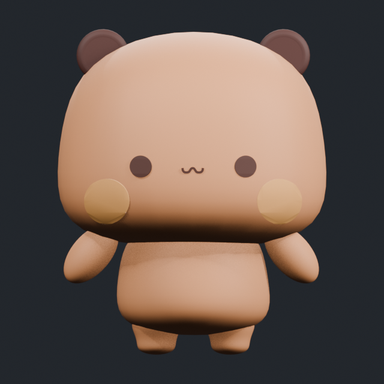

# 布布 / bubu

- `source/bubu_work-v001.blend`：从共同 GLB 分离、缩放并对齐游戏参考后的恢复点。
- `source/bubu_work-v002.blend`：拆件前恢复点；移除了 13 组完全重合且反向绕序的壳体，现为 6 个网格、8,338 顶点、14,528 三角面。
- `source/bubu_work-v003.blend`：当前首个完整游戏基线；包含头、睁眼/眨眼、四种手状态、双骨身体、刚性双脚和尾巴，已通过独立重开及 OBJ 往返校验。
- `references/`：只保存人工参考图、网页链接及 `SOURCES.md`；当前布布与一二共用已校验的 `assets/source_yier/` Sketchfab 场景。
- `textures/`：保存烘焙和绘制源文件；最终 PNG 放进资源包。

正式首版资源位于 `exports/Resources/175-bubu/`，角色 ID 为 `175`。构建脚本固定从 v002 生成新的 v003，不覆盖恢复点；详细几何、动作适配和校验记录见 `references/V003_BUILD_REPORT.md`。受限打印模型仍然只做页面级造型观察，不下载、不导入、不改模。
